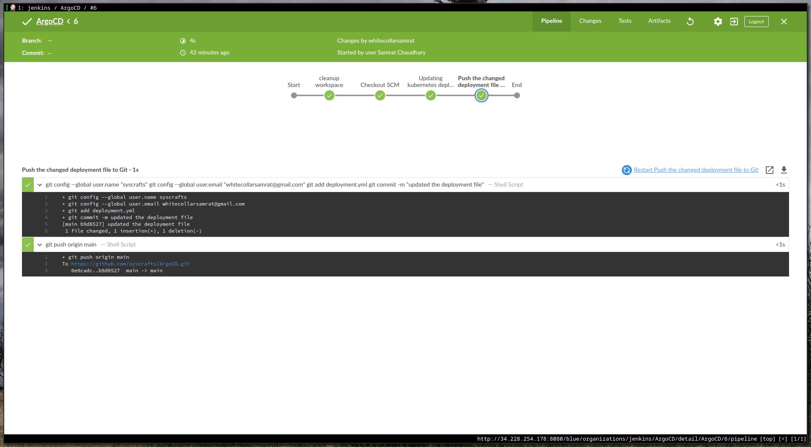
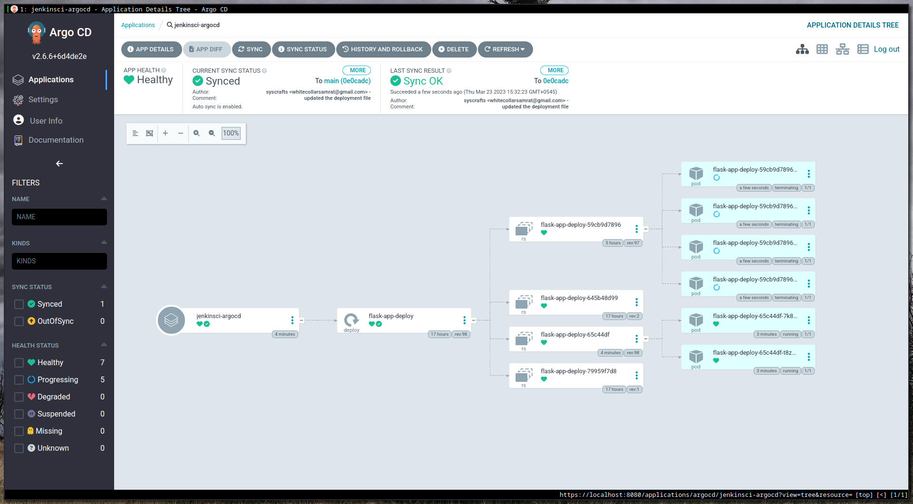

# ARGOCD to deploy to k8s cluster

This repo along with [https://github.com/syscrafts/JenkinsCI](https://github.com/syscrafts/JenkinsCI) creates a Jenkins pipeline with ArgoCD to deploy code into a Kubernetes cluster. CI part is done via Jenkins and CD part via ArgoCD.

When jenkins pipeline is triggered, then:

This is how it looks after deployment in K8s cluster.

